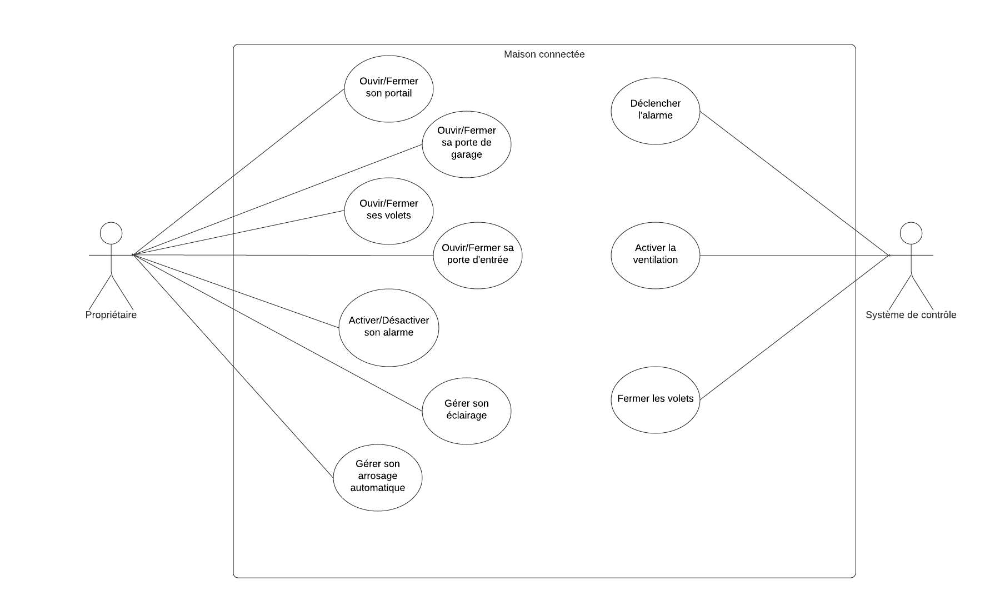

# Maison connectée 

## Description du projet

  Avec l'essor des objets de plus en plus connectés, de nombreuses personnes aimeraient pourvoir connecter des objets courants afin d'amener de la praticité et de la facilité dans leur quotidien. C'est à partir de cette constatation que le terme de la "maison connectée" est apparu.  
  
De nous jours, de plus en plus de maisons deviennent connectées grâce à la domotique. Très longtemps chère et lourde à mettre en place, la domotique a su s'imposer et est, aujourd'hui, présent dans de nombreux foyers.   
  
La sécurité, la communication ou encore la l'économie d'énergie sont des exemples de domaines que touche la domotique.  
	
La maison intelligente a pour objectif de faciliter les actions du quotidien, d'automatiser des tâches, d'avoir un foyer plus sécurisé ou encore de réduire son impact écologique.  

## Etat de l'art
  
Aujourd'hui, le marché de la maison connectée est en plein essor. On estime à **2 milliard d'euros le chiffre d'affaire** engendré par les objets connectés dans les maisons en France avec par exemple 650 millions d'euros rien que pour l'électroménagers intelligents. Les objets connectées représente **5,2 millions d'objets** installés dans les maisons françaises. Ces données suivent une progression à deux chiffres.  

 
  
Dans le monde cela représente un marché entre **50 et 80 Milliards** de chiffre d'affaire.    

Les principaux marchés se situent dans les pays développés avec en top position les Etats-Unis, le Japon et l'Allemagne. La France arrive en 5e position.  

Au vue de la croissance dans ce domaine, de nombreux acteurs proposent de connecter sa maison. Cette connexion passe par tous les objets du quotidien. De ce fait, des entreprises d'électroménagers, de jardinage, de bricolage ou encore d'électronique proposent des produits et services afin de rendre intelligente votre maison. A l'instar de Castorama, Darty ou Verisure  qui proposent respectivement des portails, de l'électroménager et des alarmes connectées.  
	
Ce boom des objets connectés dans les maisons à contraint de mettre en place des normes permettant de garantir la sécurité des systèmes ou encore de protéger les données privées. L'organisation internationale de normalisation se charge de mettre en place des nouvelles normes concernant les objets connectés, en particulier des **normes ISO**. Nous avons par exemple la norme ISO/IEC 30141 qui permet d'établir une architecture de référence normalisée de manière internationale. Afin de proposer un vocabulaire commun, des schémas conceptuels réutilisables et les meilleures pratiques du secteur. Ou encore la norme ISO/IEC 27701 garantissant la protection des données personnelles.
	
  Dans une maison, tous les objets peuvent être connectés. On peut planifier l'arrosage automatique et la fermeture automatique des volets, allumer des lumières avec son Smartphone, ouvrir automatiquement son portail, avoir une alarme connectée ou encore gérer son chauffage à distance. 
	
  Nous proposons donc de réaliser une maquette d'une maison connectée. Cette maquette permettra de gérer son portail, ses portes d'entrées, sa lumière, son arrosage automatique, ses volets, son chauffage, son alarme….
	
  Aujourd'hui, le coût des objets connectés dépasse rarement le millier d'euro individuellement. En effet, une bonne alarme connectée coûte mille euros, une lampe connectée 100€, un portail électrique 400€ ou encore des volets électriques 200€ par volet.  
 
Mit bout à bout les dépenses augmentent très vite, mais un individu peut décider de prioriser certains objets connectés par rapport à d'autre. En effet, certaine personne n'ont pas le besoin ou l'envie d'un portail connecté, par exemple.

## Etude fonctionnelle

### Contexte

Aujourd'hui beaucoup de personnes désirent une maison connectée. On ne déroge pas à la règle.  

Cette idée est venue de notre quotidien. 

En effet, nous avons tous envie d'appuyer sur un simple bouton pour ouvrir notre portail, d'être rassuré quant à la sécurisation de notre maison lorsque nous sortons de chez nous, de reduire notre impact écologique et énergétique ou encore de gérer différents systèmes à distance.   

C'est dans cette idée que nous avons voulu contruire notre propre maison connectée.  

### Les débouchés

C'est donc à partir de ces observations que nous avons commencé à regarder ce qu'on aimerait intégrer dans notre projet.
On voulais pouvoir gérer facilement et rapidement les ouvertures, intégrer des choses originales comme un arrosage automatique piloté avec une application Android, ou encore amener du confort à l'habitation.  

De plus, on voulait réaliser des choses qui serait reproductible à l'échelle humaine. Ainsi, il faut avoir une vision humaine. En effet, la plupart d'entre nous ne veulent pas qu'une fonctionnalité soit trop onéreuse ou trop complexe à mettre en place.

Il a fallu donc refléchir à ces apects avant de nous lancer dans le projet.

## Nos objectifs 
	
Afin de réaliser la maquette nous allons utiliser des composants très peu onéreux et donc accessibles de tous.  
	
Notons que d'autres groupes de IOT ont déjà réalisé une maison connecté, mais nous choisissons de ne pas s'inspirer de leur projet afin de proposer un projet personnel.   
  
 Afin d'effectuer ce projet, nous allons mettre en place :
 
 - Faire une maquette (en dur) de la maison avec son jardin
 - Ajouter à cette maquette :
 	- Un portail automatique;
	- Une porte de garage automatique;
	- Deux volets automatiques et intelligents;
	- Une porte d'entrée automatique et sécurisé;
	- Une alarme connectée;
	- Un système de régulagtion d'humidité et de température;
	- Un système de gestion de l'éclairage et de l'arrosage automatique via une application Android.
	
## Modélisation

**Diagramme d'utilisation** décrivant les actions réalisables par l'utilisateur et par le système de contrôle de la maison.

 
 
## Diagramme de Grantt

**_Section en construction_**

## Diagramme de navigation de l'application Android

   

## Avancement du projet

[Voir l'avancement du projet](https://github.com/institut-galilee/2020-SmartHomeJA/blob/master/doc/avancement.md)  

[Voir la construction de la maquette jour par jour](https://github.com/institut-galilee/2020-SmartHomeJA/blob/master/doc/construction_maquette.md)

## Branchements des composants

[Voir les branchements des microcontrôleurs](https://github.com/institut-galilee/2020-SmartHomeJA/blob/master/doc/branchements.md)

## Codes

[Voir code Application/Température/Humidité/Eclairage/Arrosage](https://github.com/institut-galilee/2020-SmartHomeJA/blob/master/src/codeAduinoApp_TempHumi_Alarme.md)  
  
[Voir code des ouvertures de la maison](https://github.com/institut-galilee/2020-SmartHomeJA/blob/master/src/codeArduinoOuvertures.md)  

[Voir code de l'application](https://github.com/institut-galilee/2020-SmartHomeJA/blob/master/src/codeApplication.md)
  

