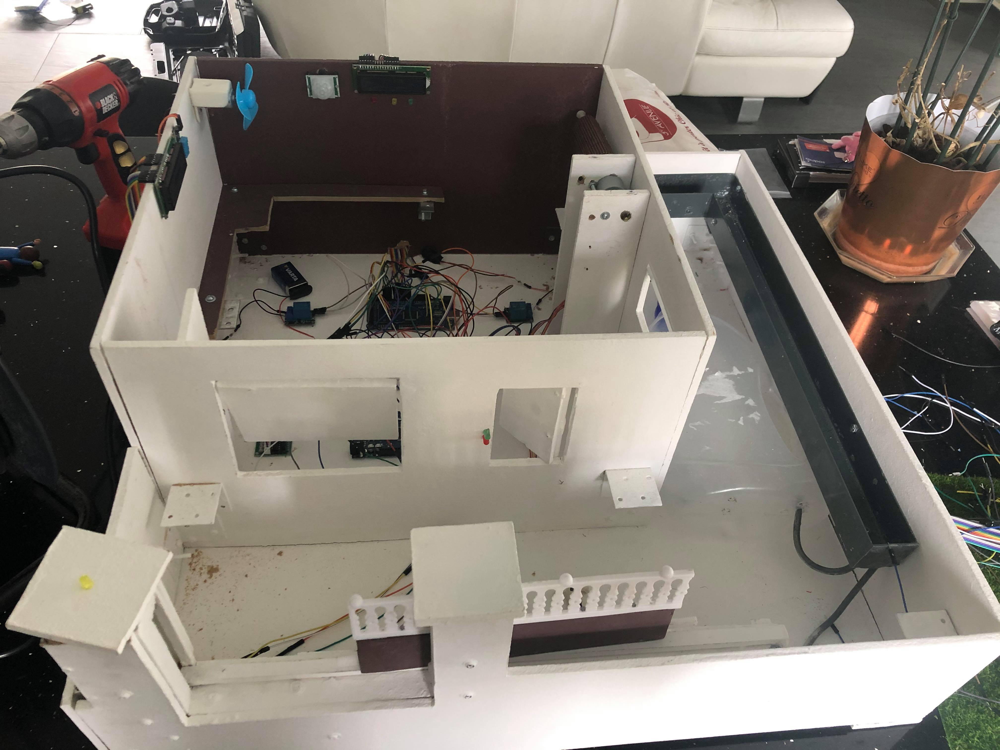
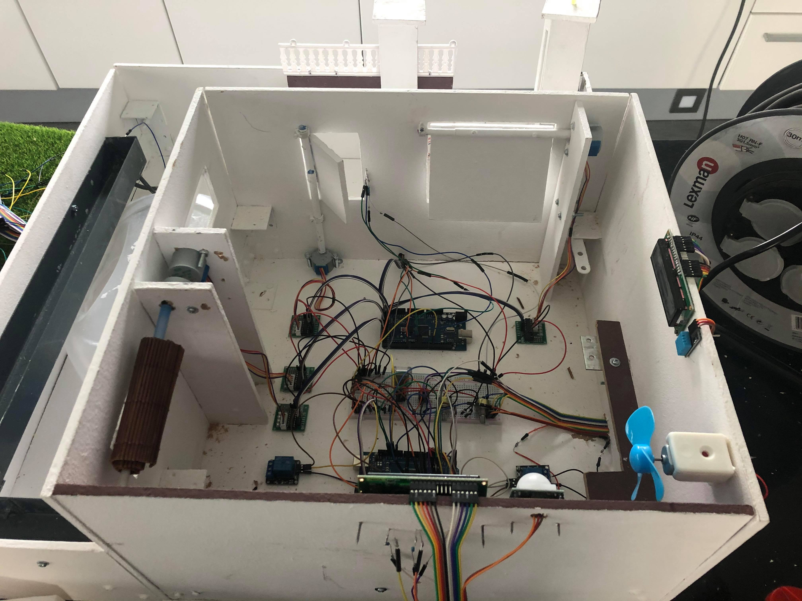
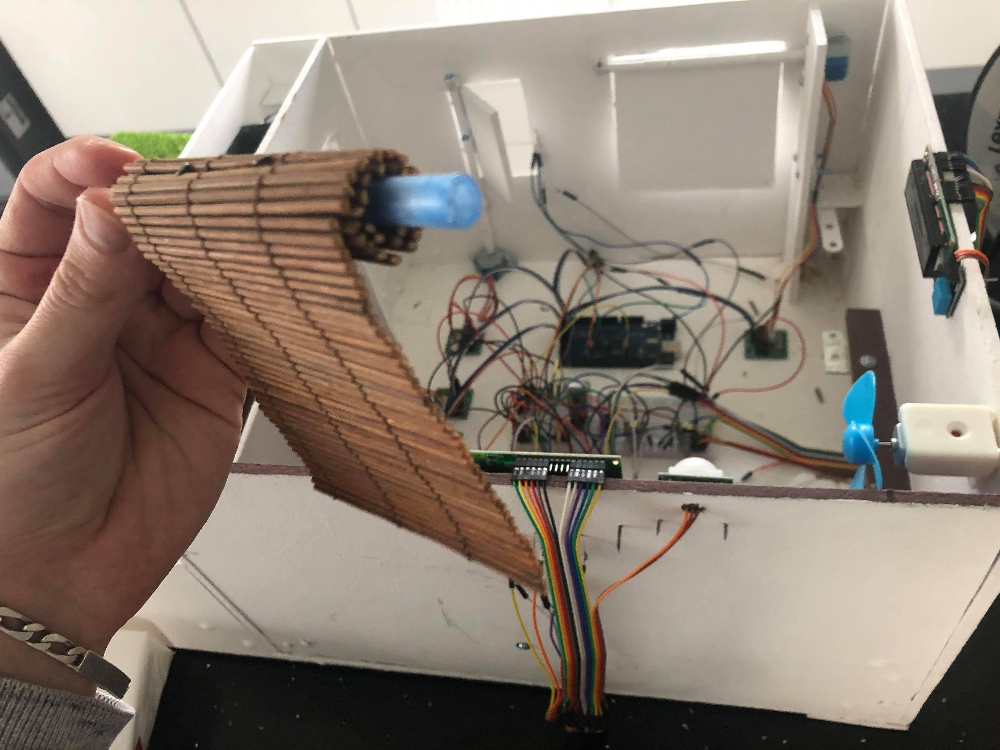

Etat d'avancement de la maison connectée au 18/03/2020.

Ce que nous avons fait : 

- Maquette de la maison 60 * 60 cm (maison + jardin) // 40 * 40 (maison seule)
  - Achat des matériaux (équerres, planches, vis, écrous...);
  - Construction intégrale de la maquette;
  - Intégrer les délimitations des zones (jardin, chambre, cuisine, salon et garage) avec des cloisons;
  - Peindre la maison en blanc et en marron;
  - Intégrer la goutière pour l'écoulement de l'eau de l'arrosage automatique.
  
  

- Construction des éléments qui sont pilotés par les composants élétroniques (éléments en mouvement)
  - Un portail coulissant;
  - Une porte de garage rabatante;
  - Deux volets composés des sets de tables pour l'enroulement et d'un stylo pour l'axe;
  - Une porte d'entrée;
  - les autres fonctionnalités n'ont pas besoin d'élément en mouvement.
  
- Branchement des composants suivant dans la partie basse de la maison :
  - le portail automatique;
  - la porte de garage automatique;
  - la porte d'entrée automatique et sécurisée;
  - les volets automatiques et intelligents;
  - alame connectée;
  - système de gestion de température et d'humidité;
  - arrosage automatique pilotée avec une application Android;
  - lumières pilotées avec une application Android.
  
- Relier tous les branchements à l'élément qu'il pilote
  ex : le moteur pas à pas du portail est relié au portail.
  
- Application Android gérant l'arrosage automatique et les lumières dees différentes zones de la maison

- Code Arduino faisant fonctionner les composants
  
 
 

  
  Ce qui nous reste à faire : 
  
  - Tester tous les fonctionnalités;
  - Commenter et optimiser le code;
  - Configurer les moteurs pas à pas pour avoir un mouvement des ouvertures le plus précis possible.
  - Mettre les décors
  
