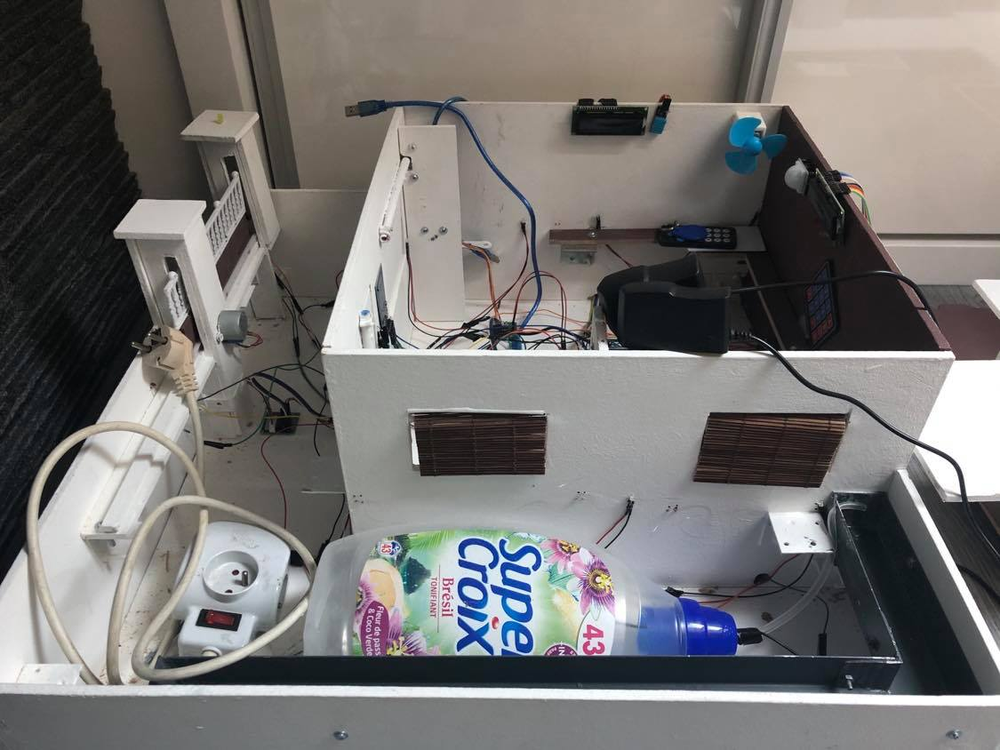
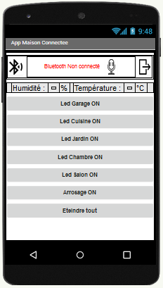

Ce document traite de l'état d'avancement du projet de la "Maison connectée" depuis son commencement. (Version du 25/03/2020)

# Etape 1 : Préparation du matériel
	
Pour réaliser notre maquette, nous avons fait le choix d'acheter tous les composants nous mêmes via Amazon, Castorama et Action.  Il y a deux raisons à cela : nous avions envie de garder notre maquette intacte à la fin du semestre et nous avons besoin d'autres composants ou en plus grande quantité que les composants qui nous ont été fournis.

2 types de matériaux :  
	
- A : Les composants électroniques : 
	- 2 microcontrôleurs Elegoo Mega 2560 r3 (compatible Arduino);
	- 2 modules LCD (16 x 2);
	- 1 KeyPad (Clavier 4 x 4);
	- 5 moteurs pas à pas;
	- 1 RFID MFRC RC-522 avec 2 badges;
	- 1 capteur d'humidité et de température digital DHT11;
	- 1 télécommande infrarouge avec son récepteur;
	- 23 Leds (2 jaune, 2 rouge, 2 vertes, 17 blanche);
	- 1 Capteur de mouvement HC-SR501;
	- 1 capteur de luminosité (photorésistance);
	- 2 Relais KY-019 5 Volts;
	- 2 Piles 9 Volts;
	- 1 Pompe à eau 5 Volts 100L/H;
	- 1 moteur en courant continu;
	- 2 buzzers passifs
	- 1 module sans fil Bluetooth HC-06;
	- Des câbles (mâle/mâle, mâle/femelle, femelle/femelle) et des résistances (220 Ohms).
	
- B : Les matériaux de construction : 
	- 3 plateau aggloméré 120 cm * 60 cm * 5 mm;
	- Peintures (blanche, marron et grise);
	- Fil transparent de nylon;
	- Colle;
	- Pâte à bois;
	- Tuyau à eau transparent;
	- Reste de rail en aluminium;
	- Patin de chaise en feutre;
	- Corps de stylo;
	- Silicone;
	- Engrenage (Pignons et crémaillères en plastique);
	- Equerres en acier;
	- Gazon synthétique;
	- Brique de pierres rouge;
	- Boulons, vis, rondelles, clous et de l'étain.
	
- C : Outils utilisés : 
	- Tournes vis plats et cruciformes;
	- Perceuse et forets;
	- Cutter;
	- Scie circulaire;
	- Scie sauteuse; 
	- Scie à onglet;
	- Marteau;
	- Enrouleur 4 prises;
	- Pinces;
	- Station de soudage;
	- Rouleau de peinture;
	- Clé plates;
	- Ciseaux;
	- Mètre;
	- Crayons;
	- Niveau;
	- Règle.
	
# Etape 2 : Plan de la maquette :

La maquette mesure 60cm* 60cm (jardin + maison). La dimension de la maison 40 cm (longueur) * 40 cm (largeur) * 25 cm (hauteur).   

Nous avons deux étages : l'étage du bas permet de stocker et de cacher tous les composants. Tous les branchements sont dans cet étage.   

L'étage supérieur permet de voir toutes les actions. Le sol de l'étage peut se retirer afin de laisser apparaître tous les composants. Cela nous permet d'avoir un rendu esthétique tout gardant la possibilité de voir les branchements.   
	
- 5 zones distinctes : 
	- Un salon;
	- Un garage;
	- Une chambre;
	- Une cuisine;
	- Un jardin.
	
# Etape 3 : Construction de la maquette:

- A : La maison : 

	La construction de la maison s'est faite en fixant perpendiculairement les planches de bois avec des équerres. Les équerres permettent une meilleure tenue dans le temps, une meilleure adaptabilité et permettent d'effectuer des modifications plus simplement et rapidement. 
	
- B : Le jardin :

	Le jardin se compose aussi de deux étages. Celui inférieur permet d'effectuer les branchements. Dans le jardin, il y a notamment un arrosage automatique qui fonctionne grâce à un réservoir d'eau (un bidon de lessive) et une chute d'un rail de porte coulissante en aluminium. Dans le réservoir, nous avons inséré une pompe à eau permettant d'envoyer l'eau dans le rail grâce à un tuyau d'eau transparent. L'eau coule tout au long du rail grâce à une légère pente. Enfin l'eau s'évacue par deux trous au bout du rail reliés à deux tuyaux d'eau transparents qui achemine l'eau dans le réservoir.    
	Ainsi, nous avons un système en boucle. Nous ne manquerons jamais d'eau pour arroser et nous n'avons pas de soucis de débit d'eau à gérer pour la pompe.  
 

    
# Etape 4 : Les finitions:  

Nous avons fait le choix de peintre l'intégralité de la maquette. Le sol de la maison et un des murs de la maison sont peints en marron. L'arrosage automatique est peint en gris anthracite. Tout le reste de la maquette est peint en blanc.  

  
  
# Etape 5 : Construction d’éléments pilotés par les composants électriques : 

- Le portail électrique :
	Dans notre projet, le portail automatique est coulissant. Il fonctionne grâce à un système de crémaillères et de pignon. La crémaillère est fixée au portail et pignon au moteur pas à pas. Ainsi, en s'actionnant, le pignon entraine la crémaillère et permet le mouvement du portail.  
	
- Le porte d’entrée / porte de garage : 
	La porte d'entrée et la porte de garage fonctionne globalement de la même manière. 
Nous avons un corps de stylo relié et fixé au moteur pas à pas. Nous avons cloué au stylo la porte. Ainsi quand le moteur pas à pas s'actionne il fait tourner le stylo qui entraine avec lui la porte. Ce procédé permet de simuler l'ouverture et la fermeture.
   
- Les volets : 
	Les volets fonctionnent grâce à un système d'enroulement. Nous avons un corps de stylo relié et fixé à chaque moteur pas à pas. La partie qui s'enroule se compose d'un set de tables composé de fine lamelle de bois, et qui s'enroule très facilement.
	Ainsi, en s'actionnant, le moteur enroule ou déroule le set de tables simulant l'ouverture ou la fermeture du volet.
	
 
 
# Etape 6 : Développement d'une application Android : 
	
Nous avons développé une application Android grâce à l'outil App Inventor développé par le MIT.  
Nous avons fait deux versions. Une pour tablette et une pour Smartphone. Ainsi l'utilisateur a la possibilité de s'adapter en fonction de ses besoins.

- Version tablette :

  
  
- Version Smartphone :

  
  
# Etape 7 : Fixation et branchement des composants dans la maison :

Nous avons fixé tous les composants dans la partie basse de la maison.

# Etape 8 : Tester les fonctionnalités :

Nous avons effectué une longue période de tests. Ces tests imposaient de vérifier toutes les fonctionnalités et tous les scénarios possibles de notre projet.   
	  
A la suite de ces tests, nous avons décelé des dysfonctionnements  que nous avons résolus. Par exemple, l'activation de plus de 3 moteurs pas à pas à la suite faisait disjoncter l'Elegoo Mega. Pour régler ce problème, nous sommes retournés dans le code. Nous avons fait le choix de mettre à "LOW" les moteurs à la fin de leur fonctionnement. En effet, ces derniers restait allumé mais en pas en fonctionnement.  

De plus, nous avons configuré grâce à ces tests les moteurs pas à pas. En effet, il fallait configurer le temps d'action de chaque moteur en fonction de leur utilité. Par exemple, la porte d'entrée n'a pas le même temps de fonctionnement que le portail. 

 [Voir les étapes jour par jour de la construction de la maquette (Etapes : 3,4,5 et 7)]((https://github.com/institut-galilee/2020-SmartHomeJA/blob/master/doc/construction_maquette.md))
