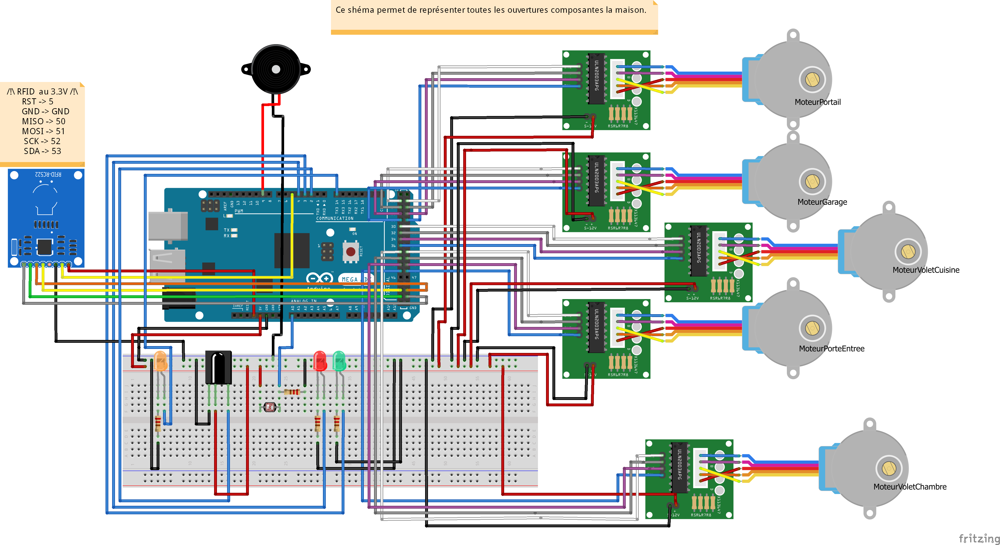
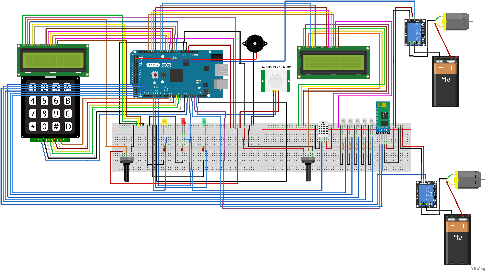

Ce document traite des branchements de la "Maison connectée. (Version du 25/03/2020)

Notre projet se compose de deux Elegoo Mega 2560 r3 (compatible avec Arduino) autour desquels s'organisent les branchements. 

# Branchement Elegoo Mega 1
  
Ce microcontrôleur commande toutes les ouvertures de notre projet.
  
Matériels nécessaires : 
  
- 1 microcontrôleur Elegoo Mega 2560 r3 (compatible Arduino);
- 5 moteurs pas à pas;
- 1 RFID MFRC RC-522 avec 2 badges;
- 1 télécommande infrarouge avec son récepteur;
- 3 Leds (1 jaune, 1 rouge, 1 vertes)
- 1 capteur de luminosité (photorésistance);
- 1 buzzer passif
- Des câbles (mâle/mâle, mâle/femelle, femelle/femelle) et des résistances (220 Ohms).  

  
  
# Branchement Elegoo Mega 2

Ce microcontrôleur commande la communication Bluetooth avec l'application Android (pour l'éclairage et l'arrosage automatique), le système de gestion de l'humidité et de la température et l'alarme connectée.
  
Matériels nécessaires : 
  
- 1 microcontrôleur Elegoo Mega 2560 r3 (compatible Arduino);
- 2 modules LCD (16 x 2);
- 1 KeyPad (Clavier 4 x 4);
- 1 capteur d'humidité et de température digital DHT11;
- 20 Leds (1 jaune, 1 rouge, 1 vertes, 17 blanche);
- 1 Capteur de mouvement HC-SR501;
- 2 Relais KY-019 5 Volts;
- 2 Piles 9 Volts;
- 1 Pompe à eau 5 Volts 100L/H;
- 1 moteur en courant continu;
- 1 buzzer passif
- 1 module sans fil Bluetooth HC-06;
- Des câbles (mâle/mâle, mâle/femelle, femelle/femelle) et des résistances (220 Ohms).  

  
