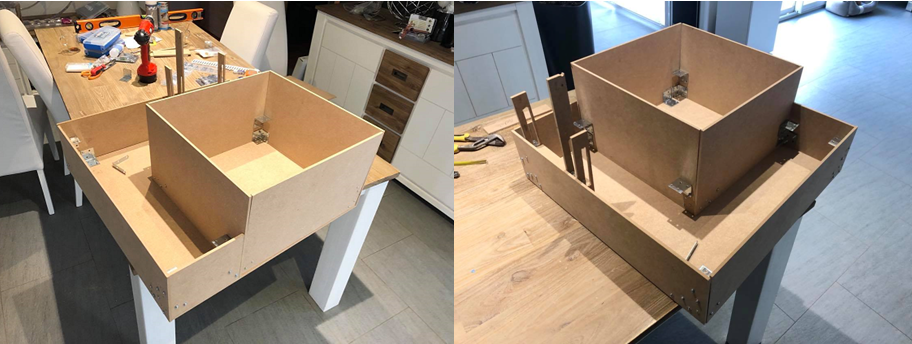
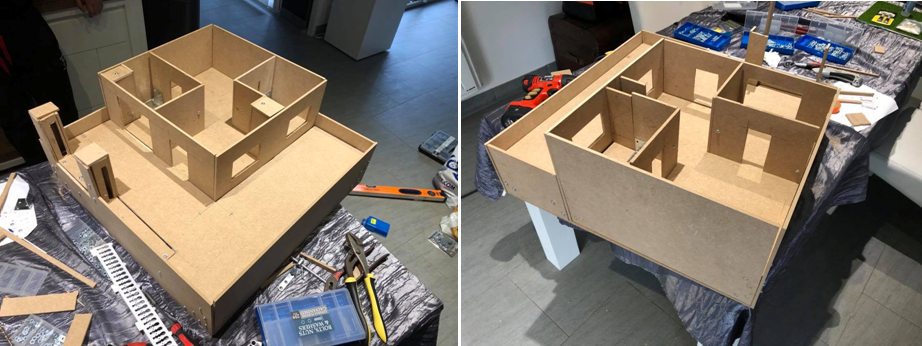
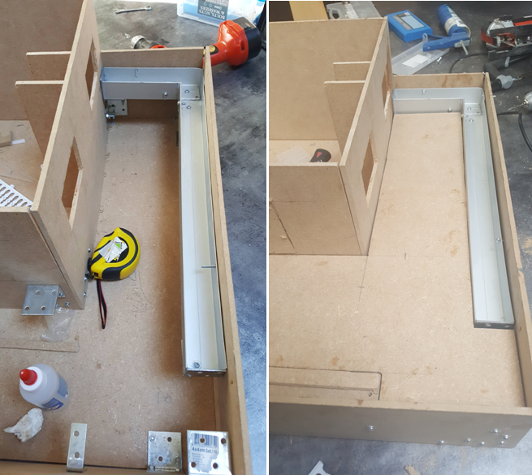
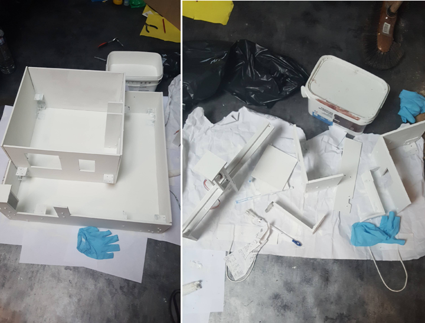
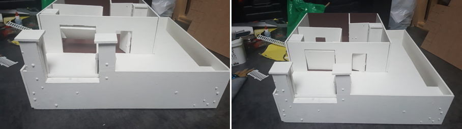
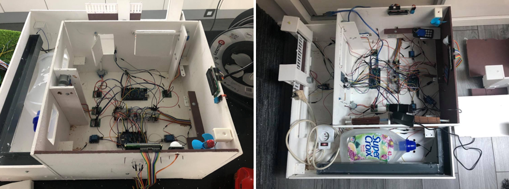

# Résumé jour par jour de la construction de la maquette

## Jours 1 et 2

Après l'achat des matériaux, on commence à construire la maison. 

- Construction des murs porteurs de la maquette et des poteaux afin d'accueillir le portail.

## Jour 3

- Construction des cloisons afin de séparer les zones et découpage des ouvertures.  

## Jour 4

- Construction du système d'écoulement d'eau pour l'arrosage automatique.  

## Jour 5 

- Peinture de l'ensemble de la maquette ainsi que des éléments qui la compose première couche en blanc).  

## Jour 6 

- Application de la seconde couche de peinture (avec une couleur différente : le marron, pour le sol et un mur de la maison).

## Jours 7, 8 et 9

- Installation des branchements électroniques dans la partie basse de la maquette  

Au rythme de 10 heures de travail par jour, nous arrivons à 90 heures de temps de travail pour la construction de la maquette.

Il est important de noter que la construction de la maquette est la 'partie visible de l'iceberg'.   
En effet, nous ne comptons pas dans cette construction les étapes de conceptions, d'achats des matériaux, de développement du code, de développement de l'application et de l'ensemble des tests et correctifs effectués.

