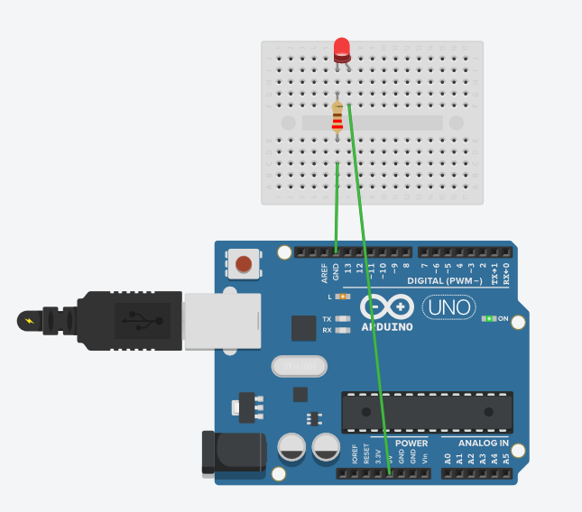
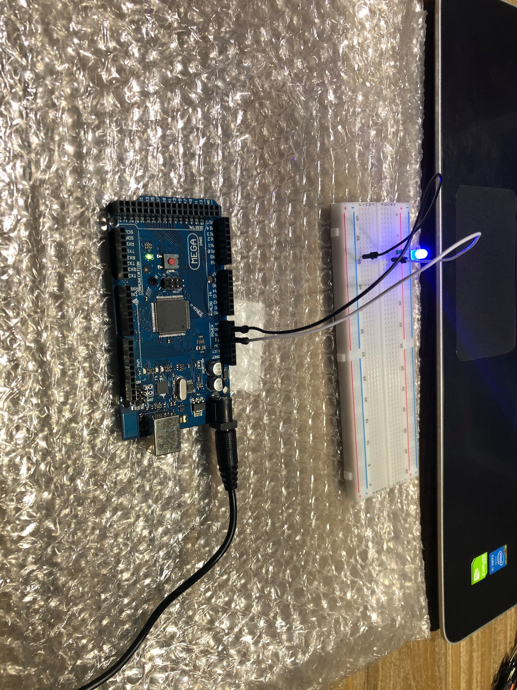
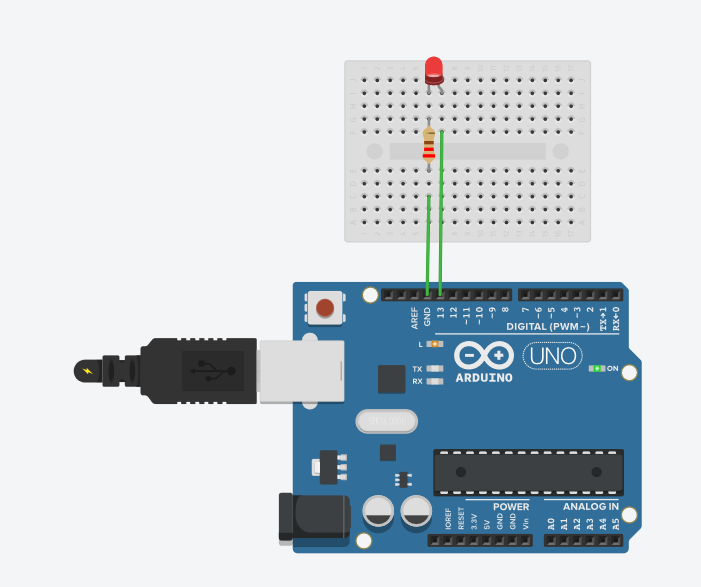
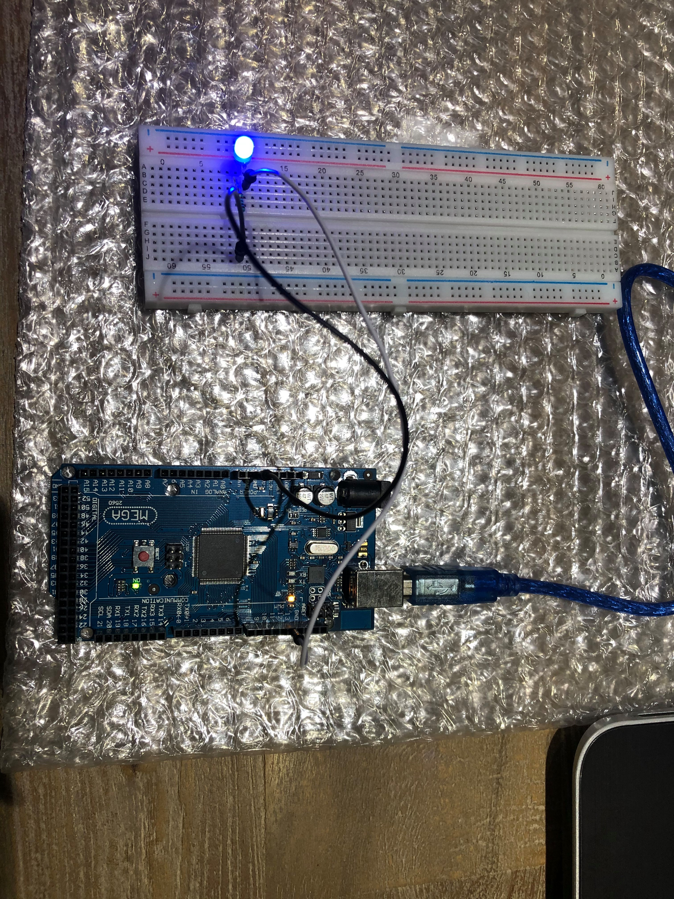

Control a LED Brightness with a variable resistance.

Matériels utilisés : 
- Un led
- Une plaquette
- Un micro contrôleur
- Une résistance 220 Ohms
- Deux câbles

a) Without a microcontroller

b) With a microcontroller

Soit le code utilisé : 

void setup() {
	pinMode(13,OUTPUT);
}

void loop() {
 	digitalWrite(13,HIGH);
}

