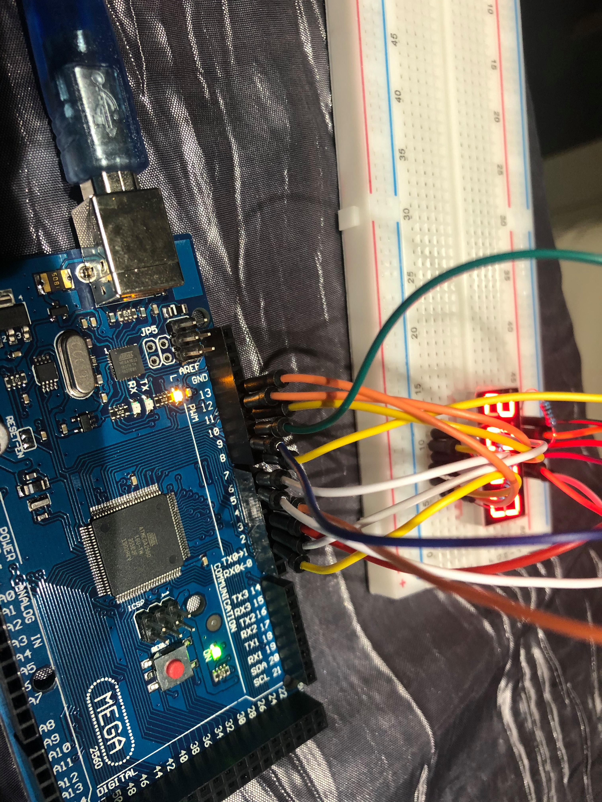
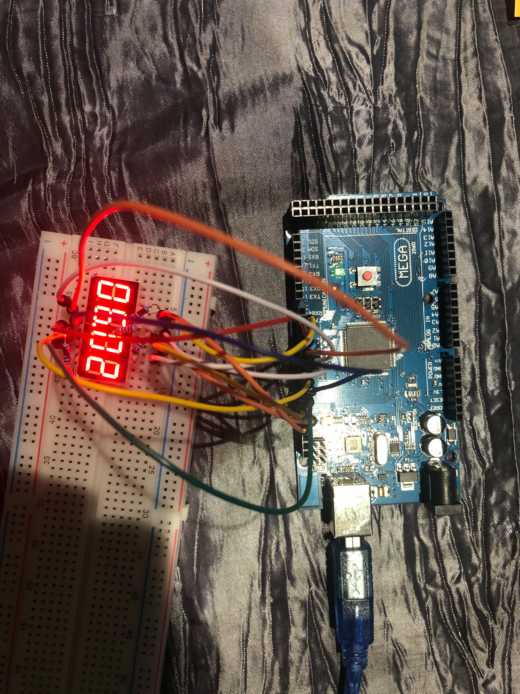
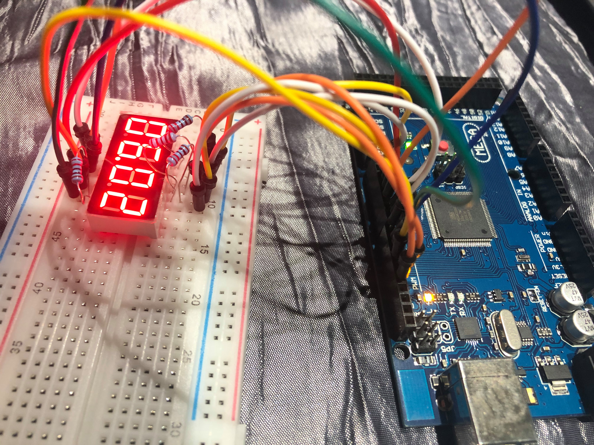

(Extra-Optional-Bonus) Display the Date (day.month)

Matériels utilisés : 
- 4 degits 7 segments display 
- Une plaquette
- Un micro contrôleur
- 4 résistances 220 Ohms
- 8 câbles

Soit le code utilisé : 

<pre> 
int digit1 = 10;
int digit2 = 11;
int digit3 = 12;
int digit4 = 13;

int segA = 2;
int segB = 3;
int segC = 4;
int segD = 5;
int segE = 6;
int segF = 7;
int segG = 8;
int point = 9 ;

void setup() {
  pinMode(10,OUTPUT);
  pinMode(11,OUTPUT);
  pinMode(12,OUTPUT);
  pinMode(13,OUTPUT);
  pinMode(2,OUTPUT);
  pinMode(3,OUTPUT);
  pinMode(4,OUTPUT);
  pinMode(5,OUTPUT);
  pinMode(6,OUTPUT);
  pinMode(7,OUTPUT);
  pinMode(8,OUTPUT);
  pinMode(9,OUTPUT);

  digitalWrite(digit1,HIGH);
  digitalWrite(digit2,HIGH);
  digitalWrite(digit3,HIGH);
  digitalWrite(digit4,HIGH);

}

void loop() {
  // put your main code here, to run repeatedly:
  setAfficher(0,6,0,2);
}

void setNumber(int nombre){
  switch(nombre){
    case 1:
      digitalWrite(segA,0);
      digitalWrite(segB,1);
      digitalWrite(segC,1);
      digitalWrite(segD,0);
      digitalWrite(segE,0);
      digitalWrite(segF,0);
      digitalWrite(segG,0);
    break;
    case 2:
      digitalWrite(segA,1);
      digitalWrite(segB,1);
      digitalWrite(segC,0);
      digitalWrite(segD,1);
      digitalWrite(segE,1);
      digitalWrite(segF,0);
      digitalWrite(segG,1);
    break;
    case 3:
      digitalWrite(segA,1);
      digitalWrite(segB,1);
      digitalWrite(segC,1);
      digitalWrite(segD,1);
      digitalWrite(segE,0);
      digitalWrite(segF,0);
      digitalWrite(segG,1);
    break;
    case 4:
      digitalWrite(segA,0);
      digitalWrite(segB,1);
      digitalWrite(segC,1);
      digitalWrite(segD,0);
      digitalWrite(segE,0);
      digitalWrite(segF,1);
      digitalWrite(segG,1);
    break;
    case 5:
      digitalWrite(segA,1);
      digitalWrite(segB,0);
      digitalWrite(segC,1);
      digitalWrite(segD,1);
      digitalWrite(segE,0);
      digitalWrite(segF,1);
      digitalWrite(segG,1);
    break;
    case 6:
      digitalWrite(segA,1);
      digitalWrite(segB,0);
      digitalWrite(segC,1);
      digitalWrite(segD,1);
      digitalWrite(segE,1);
      digitalWrite(segF,1);
      digitalWrite(segG,1);
    break;
    case 7:
      digitalWrite(segA,1);
      digitalWrite(segB,1);
      digitalWrite(segC,1);
      digitalWrite(segD,0);
      digitalWrite(segE,0);
      digitalWrite(segF,0);
      digitalWrite(segG,0);
    break;
    case 8:
      digitalWrite(segA,1);
      digitalWrite(segB,1);
      digitalWrite(segC,1);
      digitalWrite(segD,1);
      digitalWrite(segE,1);
      digitalWrite(segF,1);
      digitalWrite(segG,1);
    break;
    case 9:
      digitalWrite(segA,1);
      digitalWrite(segB,1);
      digitalWrite(segC,1);
      digitalWrite(segD,1);
      digitalWrite(segE,0);
      digitalWrite(segF,1);
      digitalWrite(segG,1);
    break;
    case 0:
      digitalWrite(segA,1);
      digitalWrite(segB,1);
      digitalWrite(segC,1);
      digitalWrite(segD,1);
      digitalWrite(segE,1);
      digitalWrite(segF,1);
      digitalWrite(segG,0);
    break;
    default:
      digitalWrite(segA,0);
      digitalWrite(segB,0);
      digitalWrite(segC,0);
      digitalWrite(segD,0);
      digitalWrite(segE,0);
      digitalWrite(segF,0);
      digitalWrite(segG,1);
    break;
   break;
  }
}

void setDigit(int digit,int nombre){
  switch(digit){
    case 1 : 
      digitalWrite(digit1,LOW);
      digitalWrite(digit2,HIGH);
      digitalWrite(digit3,HIGH);
      digitalWrite(digit4,HIGH);
      digitalWrite(point, LOW);

      setNumber(nombre);
    break;
    case 2:
      digitalWrite(digit1,HIGH);
      digitalWrite(digit2,LOW);
      digitalWrite(digit3,HIGH);
      digitalWrite(digit4,HIGH);
      digitalWrite(point, LOW);
      setNumber(nombre);
    break;
    case 3:
      digitalWrite(digit1,HIGH);
      digitalWrite(digit2,HIGH);
      digitalWrite(digit3,LOW);
      digitalWrite(digit4,HIGH);
      digitalWrite(point, HIGH);

      setNumber(nombre);
    break;
    case 4:
      digitalWrite(digit1,HIGH);
      digitalWrite(digit2,HIGH);
      digitalWrite(digit3,HIGH);
      digitalWrite(digit4,LOW);
      digitalWrite(point, LOW);

      setNumber(nombre);
    break;
  }
}

void setAfficher(int M,int C,int D,int U){
        setDigit(4,M);
        delay(2);
        setDigit(3,C);
        delay(2);
        setDigit(2,D);
        delay(2);
        setDigit(1,U);
        delay(2);
  
}

</pre>
