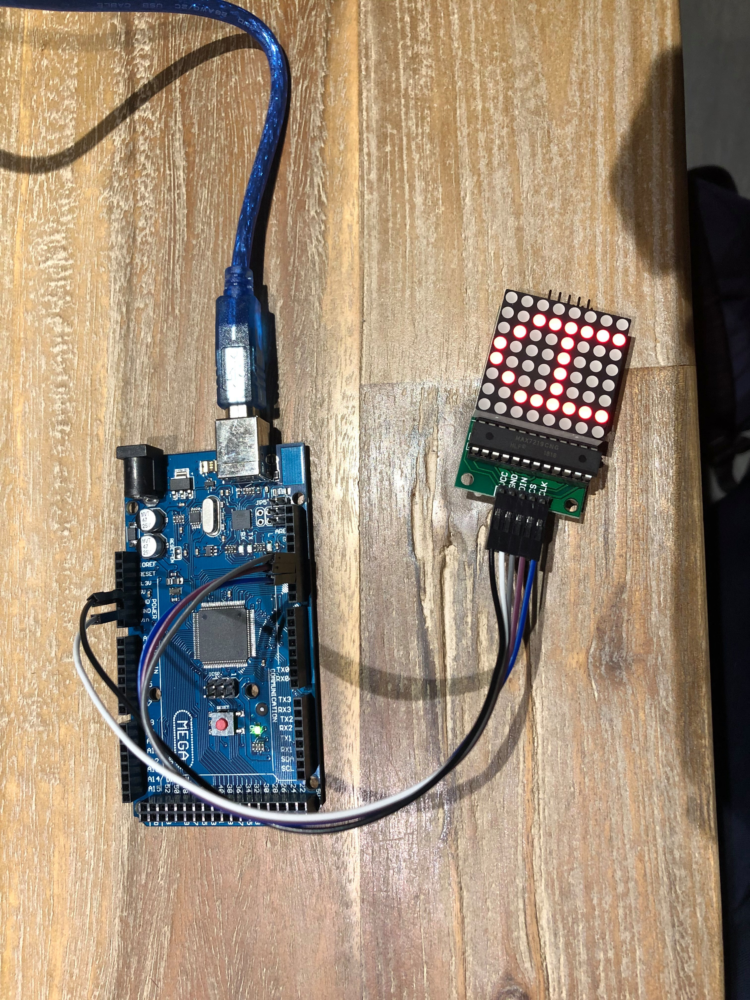

Do Using Max7219 For LED Matrix Until the section Android App for Controlling 8×8 LED Matrix via Bluetooth

Matériels utilisés : 
- Une matrice led 8x8
- Un micro contrôleur
- Cinq câbles

Soit le code utilisé : 

int DIN_pin = 12;
int CS_pin = 11;
int CLK_pin = 10;
int A[8] = {0x18,0x24,0x42,0x42,0x7E,0x42,0x42,0x42};

void write_pix(int data){
  digitalWrite(CS_pin,LOW);
  for(int i = 0;i<8;i++){
      digitalWrite(CLK_pin,LOW);
      digitalWrite(DIN_pin, data & 0x80);
      data = data << 1;
      digitalWrite(CLK_pin,HIGH);
  }
}
void write_line(int address,int data){
    digitalWrite(CS_pin,LOW);
    write_pix(address);
    write_pix(data);
    digitalWrite(CS_pin,HIGH);

}

void write_matrix(int * tab){
  for(int i=0;i<8;i++){ write_line(i+1,tab[i]);}
}

void init_MAX7219(void){
  write_line(0x09,0x00);
  write_line(0x0A,0x01);
  write_line(0x0B,0x07);
  write_line(0x0C,0x01);
  write_line(0x0F,0x00);
}

void clear_matrix(void){
  const int clean[8] = {0x00,0x00,0x00,0x00,0x00,0x00,0x00,0x00};
 // write_matrix(clean);
}
int intToHex(int x){
  switch(x){
    case 0 : return 0x01 ; break;
    case 1 : return 0x02 ; break;
    case 2 : return 0x04 ; break;
    case 3 : return 0x08 ; break;
    case 4 : return 0x10 ; break;
    case 5 : return 0x20 ; break;
    case 6 : return 0x40 ; break;
    case 7 : return 0x80 ; break;
  }
}
void setup(){
  pinMode(CS_pin,OUTPUT);
  pinMode(DIN_pin,OUTPUT);
  pinMode(CLK_pin,OUTPUT);
  delay(50);
  init_MAX7219();
  //clear_matrix();
}

void loop(){
  write_matrix(A);
  delay(1000);
  
}
