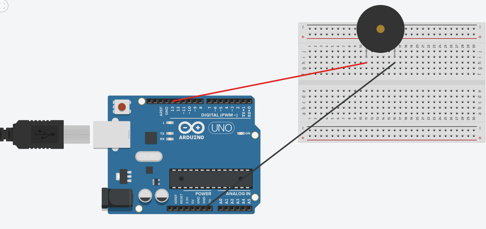
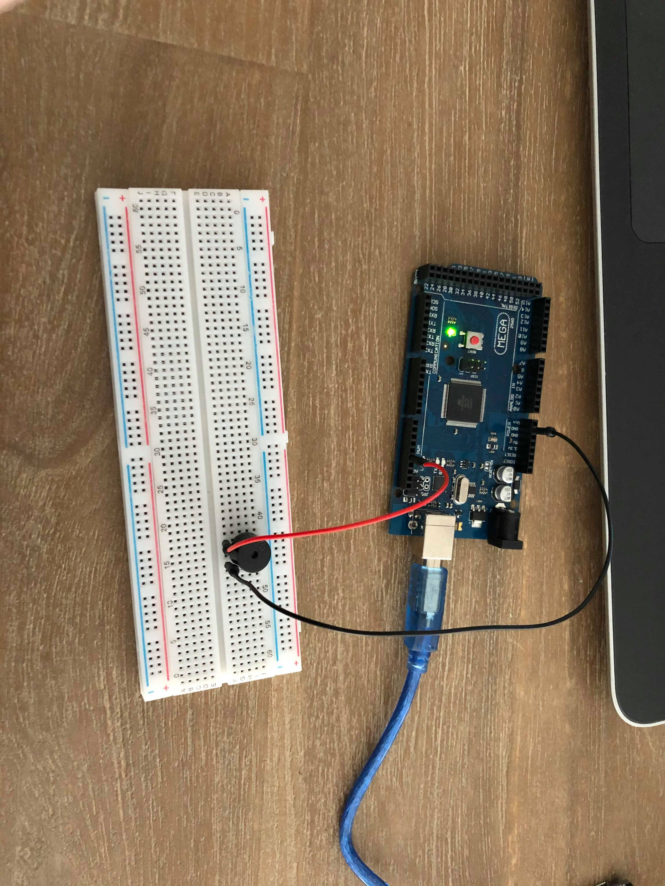
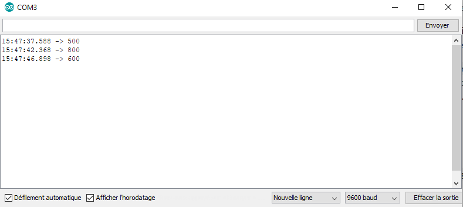
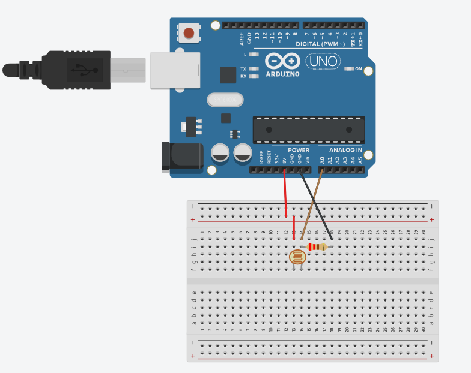
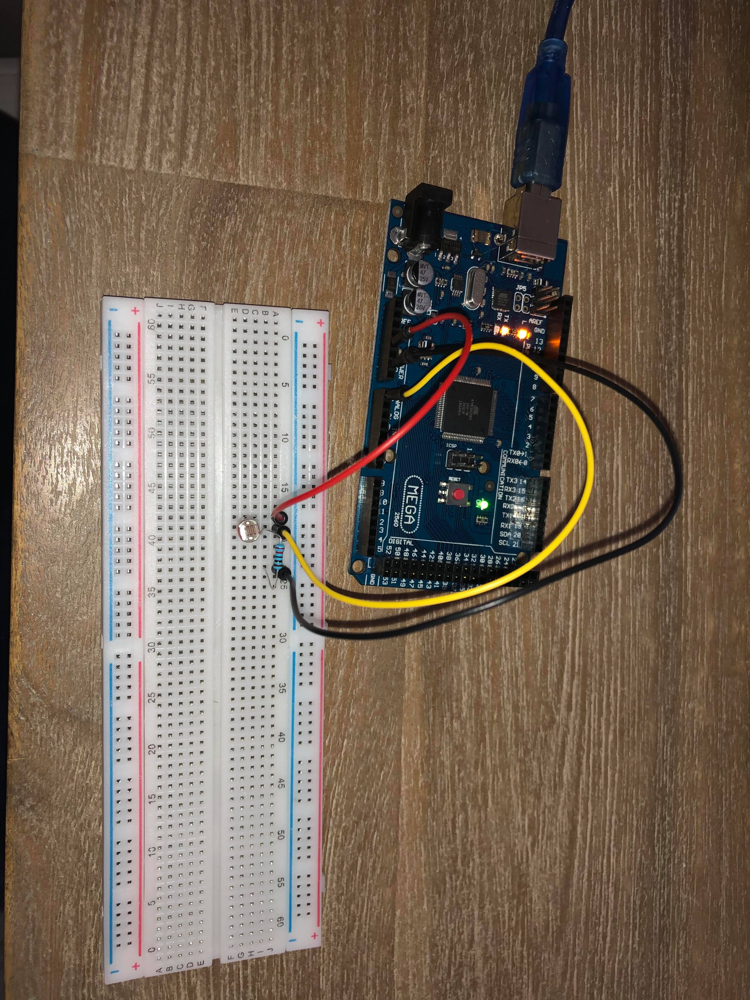
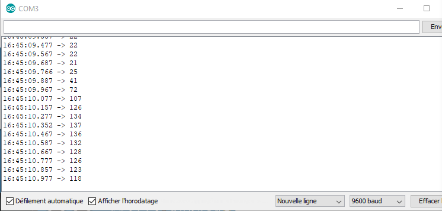
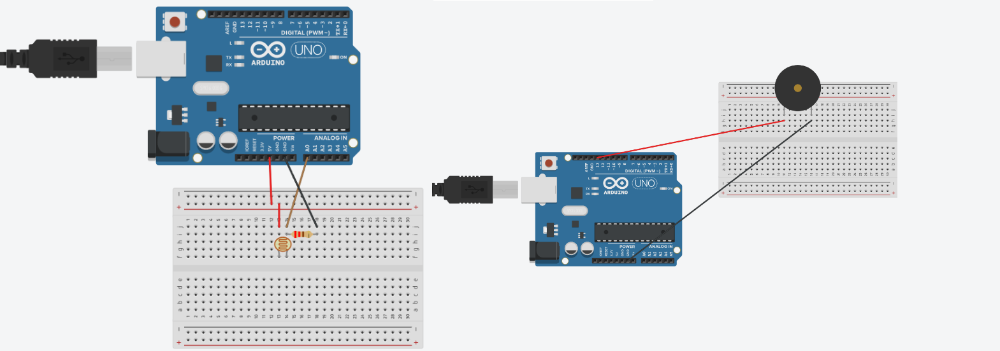
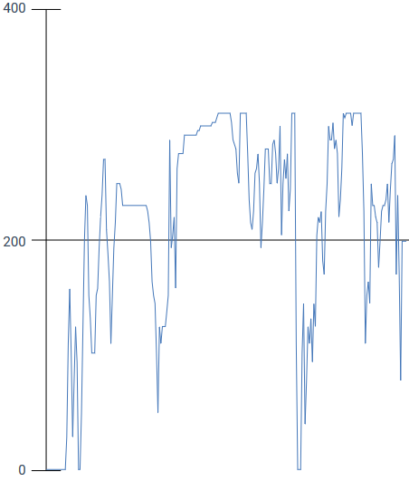

- Communication Arduino pour faire varier la fréquence d'un Buzzer passif


Matériels utilisés : 
- Un buzzer passif
- Une plaquette
- Un micro contrôleur
- Deux câbles






Code dans le fichier Code1.ino :
```C
const byte buzzer = 13;

void setup() {
  // initialize serial
  Serial.begin(9600);
  pinMode(buzzer, OUTPUT); 
}

    

void loop() {
  // if there's any serial available, read it:
  while (Serial.available() > 0) {
    //On lit l'entrée en temps que chaîne de caractères
     String b = Serial.readString()  ;
    Serial.println(b.toInt());
    //On fait sonner le buzzer avec l'entrée
    tone(buzzer, b.toInt());    
  }
}
```

Le principe est de ce branchement est d'envoyer au buzze la fréquence qu'il doit jouer. Quand il reçoit une nouvelle fréquence, il la modifie et la joue en continue.

- LDR


Matériels utilisés : 
- Une LDR
- Une plaquette
- Un micro contrôleur
- Trois câbles
- Une résistance 220 Ohms






Code dans le fichier Code2.ino : 

```C
int sensorPin = A0; // select the input pin for LDR

int sensorValue = 0; // variable to store the value coming from the sensor
void setup() {
Serial.begin(9600); //sets serial port for communication
}
void loop() {
sensorValue = analogRead(sensorPin); // read the value from the sensor
Serial.println(sensorValue); //prints the values coming from the sensor on the screen

delay(100);

}
```

Le principe est d'afficher la luminosité ambiante grâce au LDR. Le LDR capte la luminosité par un changement de potentiel et la retranscit par une valeur numérique. Dès que la luminosité augmente, l'indicateur augmente, dès qu'elle diminue, l'indicateur diminue.

Voici les shémas des deux exercices ensemble avec le plot du LDR afin de voir l'evolution de l'indicateur au fil du temps lorsqu'on alterne période de lumière et période d'obscurité.




